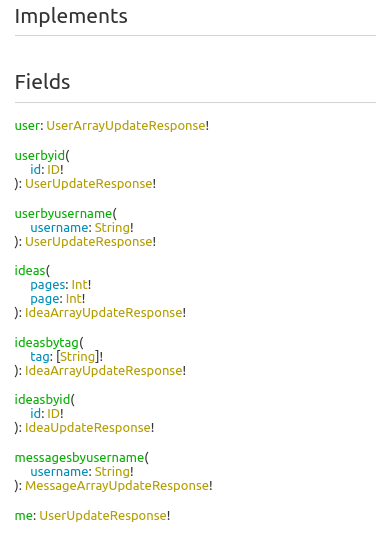
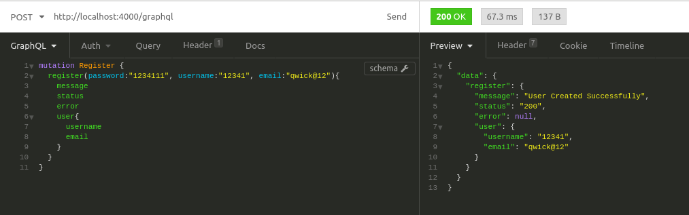
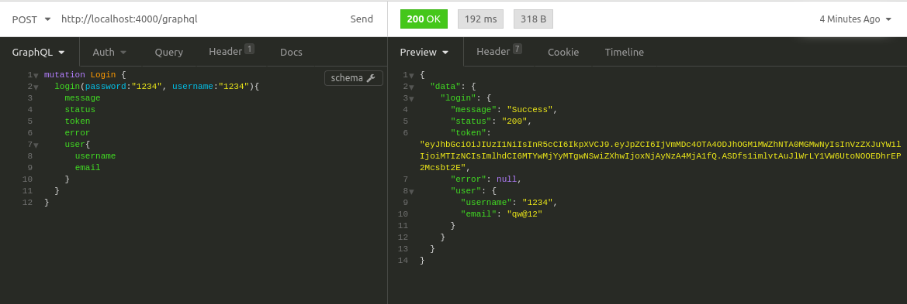
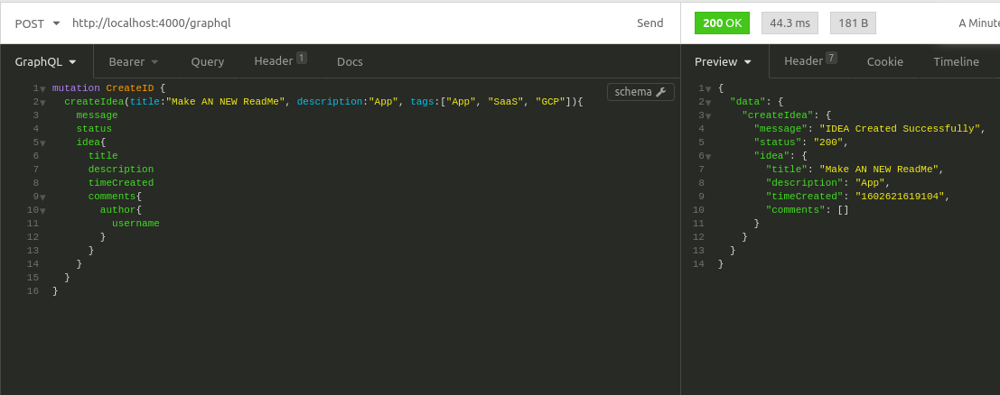

# commit-spy
This is a Graphql-based microservices project. IdeaHub is a graphql based system for storing and sharing ideas with the public while also getting feedback. It has various features for making the experience awesome. It allows users to

- Create an Account
- Post ideas Publicly and Privately
- Comment and like ideas
- Message fellow users
- make voice calls to users.

The basic backend system is completed and work is being done on the frontend part of the project. 
## GraphQL Schema
The system's graphql schema is simple and can be seen via any graphQL compatible Client when querying `https://thraine.herokuapp.com` where the project is currently hosted. For documentation sake, it is as follows.

## Images
In the image below, a new user is created.

Here is an image of the Login query.

Below, a new idea is created by an already authorized user.

